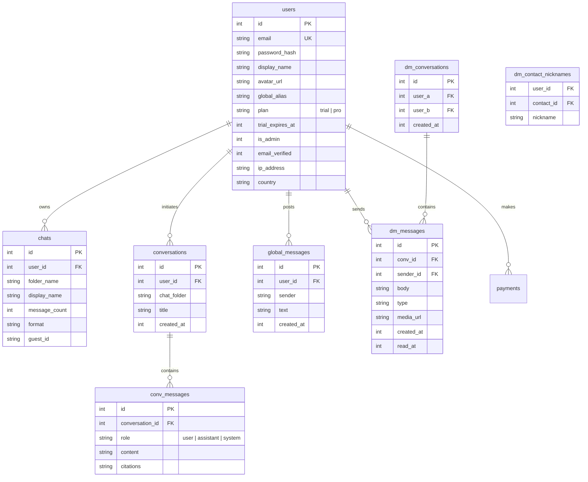

# 🌐 Kotha (onlinekotha.com) — Project Architecture & Complete Context

> **Last Updated**: August 2026 (v0.2 — Dodo international billing)  
> **Repository**: [The-CyberGenius/onlinekotha](https://github.com/The-CyberGenius/onlinekotha)  
> **Production URL**: [https://www.onlinekotha.com](https://www.onlinekotha.com)

---

## 1. Executive Summary & Core Product Vision

**Kotha** (Bengali/Hindi for *"Talk"* or *"Words"*) is a high-performance web application designed to archive, visualize, and interact with WhatsApp chat exports. It transforms static raw chat logs into rich, interactive memories while offering AI-powered personality cloning—allowing users to chat with AI avatars that speak, joke, and respond in the exact style, tone, language (including Hinglish/Hindi/English), and emoji patterns of their loved ones.

### Core Value Propositions & Features:
1. **WhatsApp Export Viewer**: Renders `.txt` and `.zip` WhatsApp chat exports into a modern WhatsApp-like UI, supporting images, audio files, videos, and multi-sender color coding.
2. **AI Personality Cloning**: Uses LLMs (Gemini / OpenAI) to analyze raw chat histories and generate an AI agent that converses like the specific contact. Context includes deep memory extraction (dates, events, sensitive info).
3. **On This Day & Memory Search**: Quick search through thousands of historical messages and instant memory surface on anniversaries or specific dates.
4. **Admin Chat Translator (Massive Scale)**: Allows administrators to translate user chats (e.g., Russian, Portuguese, Hindi, Spanish) to **Hinglish** or **English** in real-time using a custom **Delimiter-Batch Google Translate Engine** with zero AI token cost. Now features offset-based pagination to handle **1 Lakh+ message chats** smoothly.
5. **Real-time Community & Direct Messaging**: Public Global Chat room and private 1-on-1 Direct Messaging (DM) powered by `Socket.IO`, complete with typing indicators, presence, and unread receipts.
6. **Guest & Subscription Modes**: Free instant guest preview mode, user accounts, and Dodo.sh billing integration for Pro plans.
7. **SEO & Performance Optimized**: Achieving near-perfect Lighthouse scores (Performance: 100/90+, Accessibility: 100, SEO: 100). Fully dynamic meta tags, automated sitemaps, JSON-LD schema, and heavily compressed assets.

---

## 2. Technology Stack & Architecture

### Backend & Core Infrastructure
* **Runtime**: Node.js (v20+ ES6 / CommonJS)
* **Framework**: Express.js (v5.2)
* **Real-time Engine**: Socket.IO (v4.8) for live Direct Messaging, presence detection, and typing indicators.
* **Database**: SQLite3 via `better-sqlite3` (v12.10) running in **WAL (Write-Ahead Logging)** mode for extremely high concurrency and read/write speeds.
* **Security, Hardening & Rate Limiting**:
  * `helmet` (v8.2) for HTTP security headers.
  * `express-rate-limit` for DDoS & endpoint abuse protection.
  * Custom **Burst Limiter** (`checkBurstLimit` in `rateLimit.js`) to prevent API spam (e.g., maximum 10 messages per 30 seconds for DMs/Global Chat).
  * Strict maximum word count (300 words per message) for server protection.
  * `bcryptjs` for salted password hashing and secure HTTP-only cookie session management.
* **Performance Enhancements**:
  * `compression` middleware (Gzip) reducing JSON payload sizes (e.g., 50MB chat payload compressed to ~7MB). SSE (Server-Sent Events) and binary files are automatically bypassed.
* **File Uploads & Archives**: `multer`, `unzipper`, `archiver` for handling multi-MB ZIP archives containing thousands of chat text logs & media files.
* **Geo Location**: `geoip-lite` for IP-to-country resolution on registration/login.
* **Payments (dual provider)**:
  * **Dodo.sh** — international/USD billing as a **Merchant of Record** (Dodo handles global card processing + sales tax/VAT). Zero-dependency integration using the REST API + native `crypto` for Standard Webhooks signature verification (`server/dodo.js`).

### Frontend Architecture
* **Core Technology**: Vanilla JavaScript (Modular ES6+ architecture), HTML5 Semantic markup.
* **Styling**: Tailwind CSS v3 (Custom purged build: `tailwind.min.css`) + Vanilla CSS for dynamic glassmorphism and animations.
* **Progressive Web App (PWA)**: Service Worker (`sw.js`), `manifest.json`, Web Share Target integration (allows sharing `.zip` exports directly from WhatsApp to Kotha).
* **Performance & SEO Excellence**:
  * **Core Web Vitals Optimized**: Google Fonts preconnect with `font-display: swap`.
  * **Static Caching**: 7-day browser caching headers (`maxAge: '7d'`, `ETag`, `Vary: Accept-Encoding`) via Express for CSS/JS/Images.
  * **SEO Metadata**: Schema.org JSON-LD (SoftwareApplication, FAQPage), OpenGraph (`og:*`), Canonical tags, Search Console indexed `sitemap.xml`, and clean `robots.txt`. Dedicated SEO blog pages.

---

## 3. Database Schema (`server/db.js`)

SQLite database is located at `data/kotha.db` with foreign key enforcement and WAL mode enabled.



---

## 4. Key Subsystems Deep Dive

### 4.1. WhatsApp Chat Parser & Archive Handler (`server/parser.js`, `server/upload.js`)
* Supports multi-standard WhatsApp export date formats:
  * `DD/MM/YY, HH:MM - Sender: Message`
  * `[DD/MM/YYYY, HH:MM:SS AM/PM] Sender: Message`
  * `MM/DD/YY, HH:MM AM/PM - Sender: Message` (US/Indian standard)
* Extract media attachment references (e.g., `IMG-20230512-WA0001.jpg (file attached)`) and links them to local uploaded files in `data/u_<user_id>/<chat_folder>/`. Supports chunked binary streaming of large videos with HTTP `206 Partial Content`.

### 4.2. AI Personality Extraction Engine (`server/ai.js`, `server/llm.js`)
* **Prompt Engineering**: The system builds a dynamic roleplay prompt (e.g., Hinglish context) by reading up to 50 recent/relevant chat turns using basic vectorization/keyword matching (`server/context.js`).
* **Memory & Knowledge**: The AI is strictly instructed to pull dates, events, and sensitive information exclusively from the chat context provided. It never hallucinates past dates.
* **LLM Fallback Engine**: Configurable AI routes with primary and fallback models (e.g., Google Gemini 2.5/3 Pro/Flash or OpenAI GPT-4o). Streams tokens back to the web client in real time using Server-Sent Events (SSE).

### 4.3. Admin Smart Delimiter-Batch Translator (`server/admin.js`)
* **Zero Token Cost**: Uses Google Translate's free API endpoint (`translate.googleapis.com/translate_a/single?client=gtx`).
* **Delimiter Batching (`|||`)**: Concatenates 100 chat messages into a single string (`Msg1 ||| Msg2 ||| Msg3`), reducing API HTTP requests by 100x (e.g., 100,000 messages translated in ~1,000 requests instead of 100,000).
* **Concurrency & Streaming**: Executes 10 concurrent batch requests at a time and streams progress updates via **Server-Sent Events (SSE)** to the Admin UI modal.
* **Pagination & Massive Scale**: To prevent browser freezing on massive chats (100k+ messages), the backend uses an **Offset Pagination** system. It slices chunks of 1,000 messages (newest first). The Admin UI has an `⬆️ Load Older (1000 messages)` button, allowing infinite seamless back-scroll translation without memory overload.

### 4.4. Real-time Direct Messaging & Global Chat
* **Socket.IO (DMs)**: True real-time architecture utilizing `io.emit`. Tracks user presence (Online/Offline list), typing states, and read receipts (`read_at` timestamps).
* **DM Privacy**: User emails are completely hidden from API responses when searching or initiating DMs. Only `display_name` and `avatar_url` are exposed. Users can also set local nicknames for contacts (`dm_contact_nicknames`).
* **Global Chat Spam Protection**: 300-word limit per message. Burst protection (Max 10 messages per 30 seconds per IP/User).

### 4.5. Billing & Payments (Dual Provider)

Kotha Pro (`users.plan = 'paid'`) can be purchased through **Dodo.sh**. The `payments` table records every transaction with a `provider` column (`'dodo'`) and a `UNIQUE(order_id)` constraint that makes all webhook handlers idempotent against duplicate deliveries.

| **Dodo.sh** (`server/dodo.js`) |
|---|
| **Mode** | Redirect Checkout |
| **MoR** | **Yes** (handles global tax) |
| **Verify** | Standard Webhooks (`webhook-signature`, native `crypto`) |
| **SDK** | **none** — REST via native `fetch` |

**Dodo endpoints** (mounted at `/api/dodo`):
* `GET  /api/dodo/plans` — public; returns `{ available, currency, server, plans[] }` (frontend reveals the "Card" button only when configured).
* `POST /api/dodo/create-checkout` (auth) — calls `POST {api}/v1/checkouts/` with the configured product ID, `external_customer_id = user.id`, and `metadata.user_id`; returns the hosted `url` to redirect to. **This route never grants Pro** — the webhook is the source of truth.
* `POST /api/dodo/webhook` — raw-body route (mounted before `express.json()` in `server.js`). Verifies the Standard Webhooks signature (whsec-prefixed base64 secret → HMAC-SHA256 → base64, `v1,<sig>` tokens, ±5-min replay window, constant-time compare), then:
  * `order.paid` / `subscription.active` → record payment + `UPDATE users SET plan='paid'` (stores `dodo_subscription_id`, `dodo_customer_id`).
  * `subscription.revoked` / `order.refunded` → downgrade the user out of the paid bucket.

**Configuration** — set from the **Admin → Integrations** panel (encrypted in the `settings` table) *or* via env vars (`DODO_API_KEY`, `DODO_PRODUCT_ID`, `DODO_WEBHOOK_SECRET`). Secrets are **never** committed — `integrations.js` marks `api_key` and `webhook_secret` as encrypted-at-rest keys. Register the webhook endpoint in Dodo as `<PUBLIC_BASE_URL>/api/dodo/webhook`.


---

## 5. Repository File Structure Map

```
/
├── server.js               # Primary Express server entrypoint, middleware, static routing, Socket.io
├── package.json            # Node.js dependencies & scripts
├── PROJECT_CONTEXT.md      # Comprehensive project context & architecture documentation
├── server/
│   ├── admin.js            # Admin endpoints, user management, streaming SSE translation (Offset paginated)
│   ├── ai.js               # AI chat personality cloning logic & prompt generation
│   ├── auth.js             # User authentication, registration, session management

│   ├── dodo.js            # Dodo.sh checkout + Standard Webhooks (international / USD, Merchant of Record)
│   ├── cache.js            # In-memory caching layer for large chat JSONs
│   ├── context.js          # Chat context retrieval & vector/token window slicing
│   ├── crypto.js           # Encryption helpers for stored API keys
│   ├── db.js               # SQLite database setup, table definitions & migrations
│   ├── dm.js               # 1-on-1 Direct Messaging REST & Socket HTTP fallback routes
│   ├── email.js            # Nodemailer transactional email delivery (verification, password reset)
│   ├── globalChat.js       # Public community chat stream with rate/length limiters
│   ├── guest.js            # Guest session creation & temporary storage handling
│   ├── integrations.js     # Third-party service connectors
│   ├── llm.js              # Unified LLM caller with streaming & fallback provider routing
│   ├── oauth.js            # Google OAuth 2.0 Passport integration
│   ├── parser.js           # WhatsApp chat export regex parser
│   ├── rateLimit.js        # Custom Burst rate limiter & word counting
│   └── upload.js           # Multer file upload & zip extraction handler
└── public/
    ├── index.html          # Main landing page (SEO, Schema.org JSON-LD, pricing, testimonials)
    ├── app.html            # Main web app dashboard (chat viewer, AI chat, memory search, DMs)
    ├── login.html          # User authentication page (SEO indexed)
    ├── admin.html          # Admin management dashboard
    ├── blog.html           # SEO blog index
    ├── blog/               # SEO content articles (exporting chats, AI cloning, privacy)
    ├── sitemap.xml         # Search Console sitemap index
    ├── robots.txt          # Web crawler access instructions
    ├── manifest.json       # Progressive Web App manifest
    ├── sw.js               # Service Worker for offline caching & Web Share Target
    ├── css/                # Tailwind minified styles
    └── js/                 # Modular client scripts (script.js, admin.js, dm.js, features.js)
```

---

## 6. Deployment & Operations

### Production Server Architecture:
* **Host**: AWS EC2 Linux Instance (`ubuntu@13.204.243.185`)
* **Web Server / Reverse Proxy**: Nginx (Handles SSL termination & proxies HTTP/WebSocket traffic to Node.js. Handles static file caching fallback).
* **Process Manager**: PM2 (`pm2 start server.js --name kotha`)

### Automated One-Line Deployment Script:
When updating the codebase, push to GitHub and immediately trigger a pull & restart on the EC2 instance via SSH:
```bash
cd /Users/shivaprajapat/Desktop/OK
git add -A && git commit -m "update" && git push origin main && ssh -o StrictHostKeyChecking=no -o ConnectTimeout=15 -i /Users/shivaprajapat/Downloads/kotha-new-key.pem ubuntu@13.204.243.185 "cd /var/www/onlinekotha && git pull origin main && pm2 restart kotha && echo SERVER UPDATE DONE"
```

---

## 7. Developer Guidelines

1. **Database Changes**: Add new columns using `safeAddColumn(table, column, definition)` inside `server/db.js` to preserve existing SQLite WAL data.
2. **API Contracts**: Keep API parameter signatures strict to prevent runtime type errors. Ensure you enforce size limits (like `countWords(text) > 300`) to prevent DB clogging.
3. **SEO Integrity**: Any new public page must include `<link rel="canonical">`, `<meta name="description">`, responsive `<meta name="viewport">` without zoom blocks, and be registered in `public/sitemap.xml`. Always aim for a 95+ score on Lighthouse Performance and SEO audits.
4. **Performance & Concurrency**: For heavy tasks (like parsing massive zips or translating 100k messages), ALWAYS use streaming, batching, offsets, and Server-Sent Events (SSE) to prevent Node.js event-loop blocking and browser RAM crashes.

---

## 8. Changelog

### v0.2 — Dodo.sh International Billing (August 25, 2026)

Added **Dodo.sh** as the primary payment provider, giving international customers a USD checkout where Dodo acts as Merchant of Record (handling global card processing and sales tax/VAT).

#### ✨ What was added
| Area | Change |
|------|--------|
| **`server/dodo.js`** (new) | Checkout creation (Dodo REST `POST /v1/checkouts/` via native `fetch`) + Standard Webhooks handler with native-`crypto` signature verification. **Zero new npm dependencies.** |
| **`server.js`** | Mounted raw-body `POST /api/dodo/webhook` (before `express.json()`) and `app.use('/api/dodo', dodoRouter)`. |
| **`server/integrations.js`** | Added `dodo` section — `access_token` & `webhook_secret` encrypted at rest; `product_id` & `server` with env-var fallback. |
| **`server/db.js`** | `safeAddColumn` migrations: `users.dodo_customer_id`, `users.dodo_subscription_id`. (`payments.provider` already supported multiple gateways.) |
| **Admin panel** (`server/admin.js`, `public/js/admin.js`) | New **"Dodo (international billing)"** integrations card to store token / product ID / webhook secret / environment. |
| **Frontend** (`public/app.html`, `public/js/auth-init.js`) | Secondary **"Card"** upgrade button (shown only when Dodo is configured) → redirect checkout; post-redirect handler polls `/api/auth/me` and flips the plan badge to Pro. |
| **`.env.example`** | Documented `DODO_*` variables. |

#### 🔒 Security notes
- Webhook signatures verified per the [Standard Webhooks](https://www.standardwebhooks.com) spec: `whsec_`-prefixed base64 secret → HMAC-SHA256 → base64, matched constant-time against each `v1,<sig>` token, with a ±5-minute replay window. Verified with a sign→verify roundtrip test (valid accepted; tampered/forged/replayed/missing rejected; key rotation supported).
- The checkout route never grants Pro; the signed webhook is the sole source of truth. Idempotent via `payments.order_id UNIQUE`.
- Access token & webhook secret live only in `.env` or the encrypted `settings` table — never in source or committed docs.

### v0.1 — Comprehensive UI/UX Audit & Polish (August 14, 2026)

**Full project audit** covering CSS integrity, dark/light mode consistency, dock behavior, font rendering, responsiveness, animations, and deployment optimization.

#### 🐛 Bug Fixes
| # | Area | Issue | Fix |
|---|------|-------|-----|
| 1 | **CSS** | ~60 lines of duplicate rules for `#btn-wrapped`, `@keyframes pulseWrapped`, and `@keyframes shimmerWrapped` at the bottom of `style.css` (lines 2270–2329 were exact copies of 2197–2267) | Removed the duplicate block, reducing CSS file size by ~1.5KB |
| 2 | **Dark Mode — Dock** | Dock logo (`logo.svg`) used fixed purple gradients that became invisible against the dark dock background (`dark:bg-[#1c1c2e]`), resulting in low contrast | Added CSS `filter: brightness(1.35) saturate(1.3) drop-shadow()` for `html.dark #dock-kotha-icon img` |
| 3 | **Dark Mode — Fonts** | White-on-dark text suffered from "halation" (appears visually thicker on OLED/LCD), making fonts look unoptimized in dark mode | Added `font-synthesis: none` and `-webkit-text-stroke: 0.2px transparent` to `html.dark` for crisp rendering |
| 4 | **Dark Mode — AI Input** | `.ai-input` class had `background: white` and light-mode-only borders with no dark override, causing bright white flash in AI chat panels | Added complete dark mode overrides for `.ai-input`, `.ai-input::placeholder`, and `.ai-input:focus` |
| 5 | **Dark Mode — Shimmer** | `.loading-shimmer` used light-mode-only gradient colors (`#f3f4f6 → #e5e7eb`) with no dark variant | Added `html.dark .loading-shimmer` with dark palette (`#1f2c34 → #2a3942`) |
| 6 | **Dark Mode — Logout** | Logout button hover used `hover:bg-red-50` (light pink) which looked garish on dark backgrounds | Added `dark:hover:bg-red-900/20` and `dark:hover:text-red-400` for subtle dark mode hover |
| 7 | **Dark Mode — Upload Modal** | Upload modal inner container had `class="bg-white"` with no dark Tailwind class, relying solely on CSS override which sometimes missed due to nesting specificity | Added `html.dark #upload-modal .bg-white` CSS override as safety net |
| 8 | **Dark Mode — Onboarding** | Onboarding card had dark overrides for text/headings but not for input fields inside it | Added `html.dark .onboarding-card input` and `::placeholder` dark styles |
| 9 | **Meta Tags** | `theme-color` meta was `#6366f1` (indigo) for light mode, which didn't match the actual visible UI color (`#f0f2f5` sidebar header) | Changed to `#f0f2f5` in both `app.html` and `script.js` toggle function |

#### ✨ Enhancements
| # | Area | Enhancement |
|---|------|-------------|
| 10 | **Fullscreen Mode** | Dock remained visible when app was in macOS fullscreen mode since it's a separate fixed element | Added `#mac-frame.mac-fullscreen ~ #mac-dock { display: none }` and `body.app-shell:has(.mac-fullscreen) { padding-bottom: 0 }` |
| 11 | **Dark Mode — Logout UX** | Logout button hover had no distinct dark mode style, using default light-mode colors | Added explicit dark mode hover colors (`red-900/20` bg, `red-400` text) |

#### 📁 Files Modified
- `public/css/style.css` — Removed duplicates, added 12 new CSS rule blocks for dark mode completeness
- `public/app.html` — Fixed `theme-color` meta, added dark Tailwind classes to logout button
- `public/js/script.js` — Updated `toggleTheme()` light mode meta-color
- `PROJECT_CONTEXT.md` — Added this changelog

---

## 9. Business Model & Growth Strategy

**Model:** Freemium with Hard Limits + Affordable Global Pro Subscription.
- **Guest / Free Tier:** Users get a taste of the platform. They can view chats, use the global room, and get a strict hard limit of 3 AI messages per day (rate limited via HTTP 429).
- **Pro Tier ($5/month):** Unlimited AI chats, deep memory extraction, saved chats forever, priority support.
- **Why it works:** The $5 price point is highly affordable for Western and international users (less than a cup of coffee) but generates significant volume when scaled. Dodo.sh handles all VAT, Sales Tax, and currency conversions effortlessly.

---

## 10. Environment Variables & Sensitive Secrets

**WARNING: NEVER commit `.env` or this file to GitHub.** (This file is added to `.gitignore`).
The EC2 server requires the following environment variables to run:

```env
# SERVER
PORT=8000
NODE_ENV=production

# DODO PAYMENTS CONFIG
DODO_API_KEY=dodo_pat_...
DODO_WEBHOOK_SECRET=whsec_...
DODO_PRODUCT_ID=c9299c33-...

# GOOGLE GEMINI (AI CLONING)
GEMINI_API_KEY=AIza...

# AUTH SECRETS
SESSION_SECRET=super_secret_cookie_string
GOOGLE_CLIENT_ID=...
GOOGLE_CLIENT_SECRET=...
```
